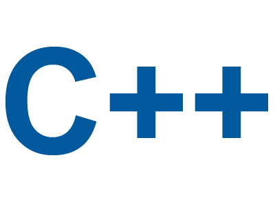

# Hello, folks! 

 

I am a pre-final year student at Rungta College of Engineering & Technology ,Behind Nandanvan, Raipur. I like exploring tech and building new stuffs. I love learning new languages and methods through which I can talk to my Computer, Smartphones, Smart Gadgets .... etc.

My Specialties includes quick learning new skills and problem solving.

**Talking about Personal Stuffs:**

- 👨🏽‍💻 I’m currently building my Web Development skills.
- 🌱 I’m currently a learner.
- 💬 Ask me about anything, I am happy to help;
- 📫 How to reach me: [Shubham Sharma](https://www.linkedin.com/in/0xshubhamsharma2022/);

**Languages and Tools:**

  

  <!--     -->
  <!--   -->
  
  
  

   
  

  
  
  
  
  
  
  
  
  

📈 My GitHub Stats

 
<!-- 
  -->

### 📫 [Connect with me](https://www.linkedin.com/in/0xshubhamsharma2022/)
